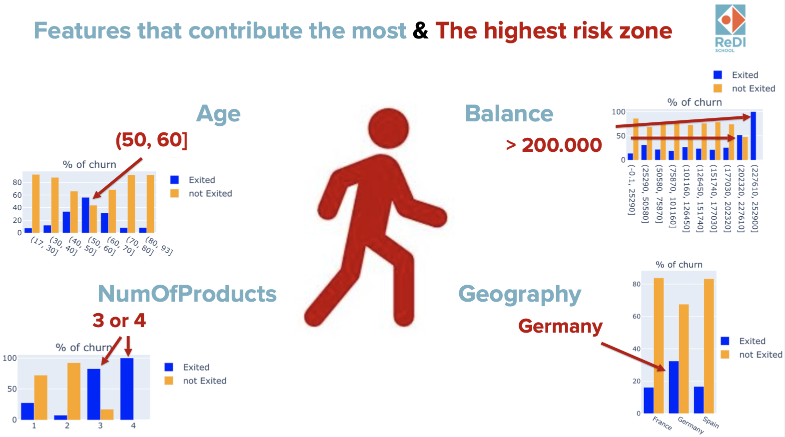
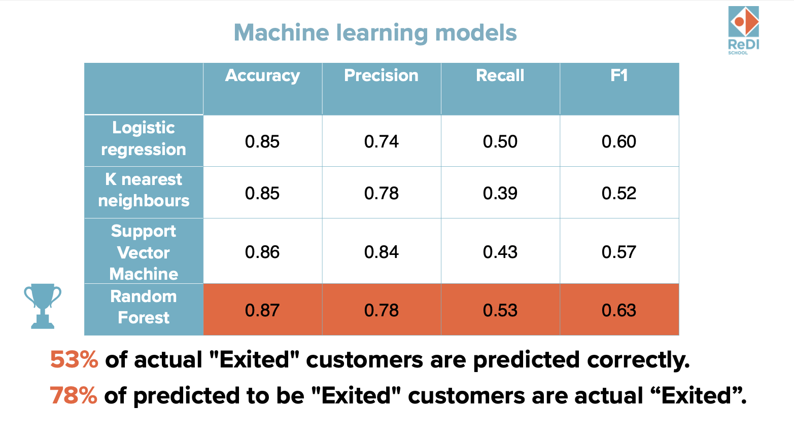
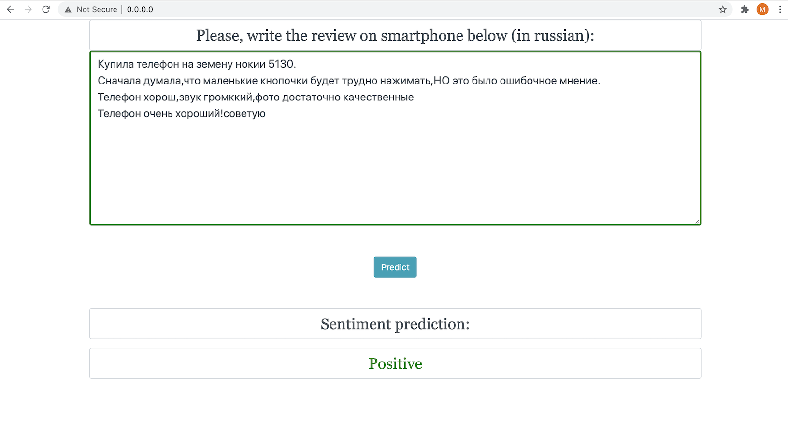
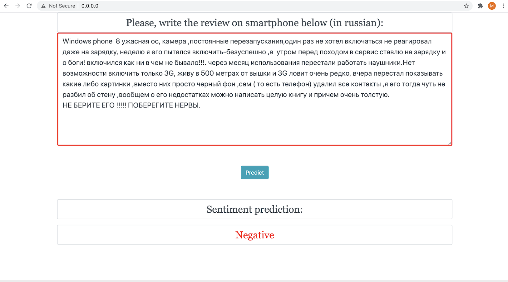

# [Project 1. Bank customer churn prediction](https://github.com/MarinaTrofimovich/Projects)

The project solved the problem of predicting the churn of bank customers. Using churned customers as an instrument of analyzing why customers are leaving, I revealed how and when churn occurs in a customer's life cycle with the bank and predicted the customer's churn. In the future the bank could enforce these results in preemptive measures.

## Overview

- Identified and visualized what factors contribute to the customer churn (using pandas, numpy, matplotlib, seaborn, plotly).

- Prepared the data for the prediction model (features selection, removing outliers, encoding categorical variables, splitting into train and test parts with shuffling to balance the data, scaling).

- Developed a prediction model which can classify if the customer is going to leave or not (trained Logistic Regression, k-nearesr neighbors, SVC, Random Forest and optimized them using GridSearchCV).

- Analyzed the metrics and chose the best model in accordance with business goals.

## Tools

***Python version:*** 3.8.3.

***Packages:*** pandas, numpy, matplotlib, seaborn, plotly, sklearn 

# [Project 2. Sentiment analysis reviews for the customer's task](https://github.com/MarinaTrofimovich/sentiment_analysis_yandex)

## Overview

- Produced a tool for predicting the sentiment of smartphone reviews.

- Scraped over 23000 reviews on smartphones from the Yandex market using Python and Selenium.

- Performed data cleaning and data selection to finding the best way of labeling the data (final number of reviews 6500+).

- Optimized a pepiline "CountVectorizer(), TfidfTransformer(), LinearSVC()" using RandomizedSearchCV to reach the most accurate model.

- Developed a client facing API using Flask.

- The accuracy on customer's data is about 95.5%.

## Tools

***Python version:*** 3.8.3.

***Packages:*** selenium, BeautifulSoap, sklearn, pickle, joblib, pandas, seaborn, nltk, json, flask.

## Flask API screenschots

